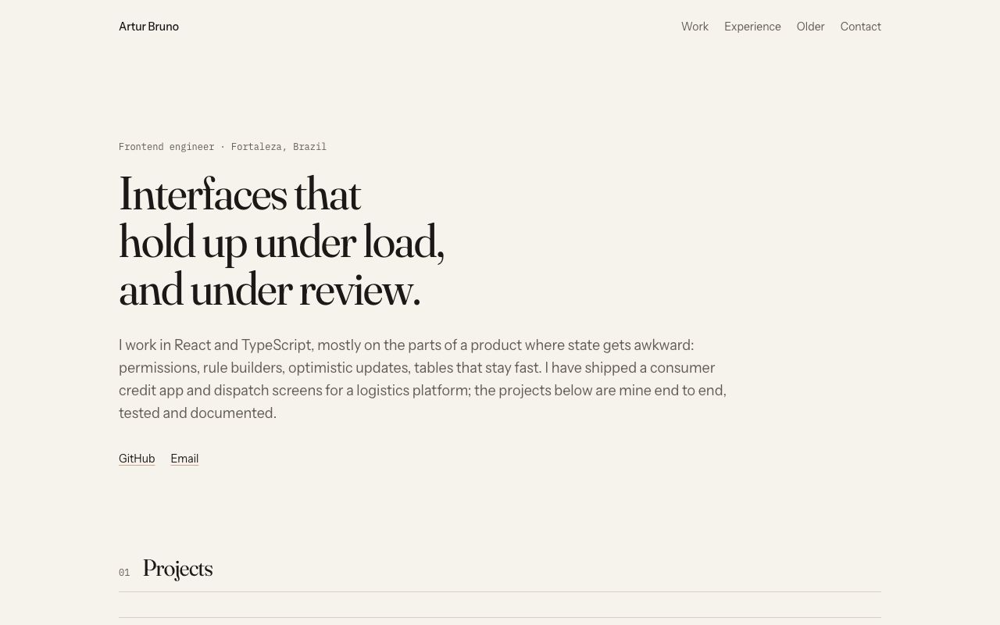

<h1>brunoskyy.github.io</h1>

My portfolio page: a single static page listing the projects I want people to
open, with a line on each about the part worth reading.

<a href="https://brunoskyy.github.io">brunoskyy.github.io</a>



## Running it

```bash
nvm use
npm install
npm run dev
```

`npm run build` writes the static site to `out/`, and `npm run preview` serves
that folder the way GitHub Pages will.

Repository metadata (language, last push) is fetched from the GitHub API at
build time. Without a token the anonymous rate limit is enough for a handful of
builds an hour; set `GITHUB_TOKEN` to raise it. If the API does not answer,
the build still succeeds and the cards just lose those two fields.

## Editing the projects

Everything shown lives in `src/data/projects.ts`:

- `featured` is the main list. Each entry has the description, the "worth
  reading" line and the stack, plus flags for private or unfinished repos.
- `otherWork` is the older repositories list, with a local description for the
  ones that never got one on GitHub.
- `profile` holds the name, email and site URL used in metadata and links.

## Deploying

Pushing to `main` runs `.github/workflows/deploy.yml`: typecheck, tests, build,
then `actions/deploy-pages`. The repository's Pages source has to be set to
"GitHub Actions" once, under Settings, Pages.

## Design notes

Warm paper background, ink text, one terracotta accent, and Fraunces for
headings with its optical size and softness axes set. Light and dark follow
the system until you pick one with the button in the header; the choice is
kept in localStorage and applied by a tiny script in `<head>` before the
first paint, so there is no flash of the wrong theme. Reduced motion is respected and everything is reachable
by keyboard, including a skip link.
